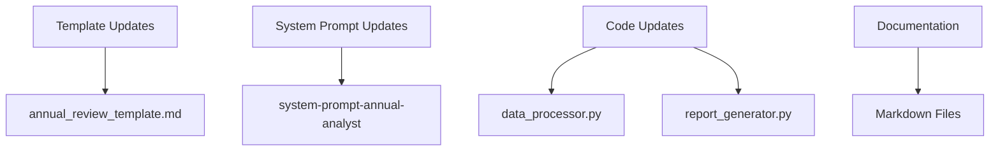
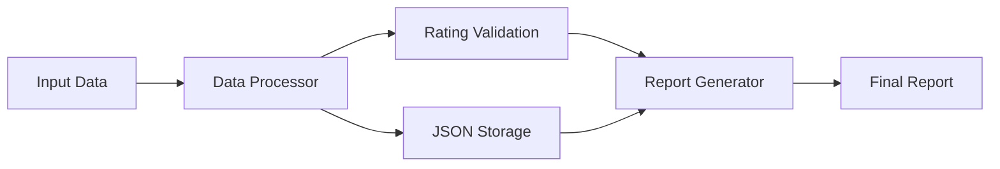

# Self-Rating Implementation Plan

## Overview
Implementation of a self-rating system for annual reviews to reflect how well achievements align with the criteria on a scale of 1 (Poor), 2 (Good), 3 (Excellent).

## Implementation Steps

### 1. Update Annual Review Template
- Add a new "Self Rating" section under each criterion section
- Include rating scale definition at the beginning of the document
- Maintain consistent Markdown formatting

```markdown
### Self Rating
**Rating**: [1-3]
**Justification**: Brief explanation of why this rating was chosen

Rating Scale:
1 - Poor: Minimal alignment with criteria expectations
2 - Good: Meets most criteria expectations
3 - Excellent: Consistently exceeds criteria expectations
```

### 2. Modify System Prompt
- Update `.roo/system-prompt-annual-analyst` to include rating analysis
- Add rating guidelines and assessment criteria
- Include requirements for rating justification

### 3. Update Data Processing
- Modify `src/data_processor.py` to handle self-ratings
- Add rating validation (1-3 scale)
- Include rating in JSON output structure

### 4. Update Report Generation
- Modify `src/report_generator.py` to include ratings in final output
- Add rating visualization (if desired)
- Ensure proper formatting of rating sections

### 5. Create Rating Guidelines
- Document clear criteria for each rating level (1-3)
- Provide examples of what constitutes each rating
- Include guidance for consistent rating application

## Rating Criteria Framework

### Rating Definitions

1. Poor (Rating: 1)
   - Minimal demonstration of criterion expectations
   - Few concrete examples of meeting requirements
   - Significant room for improvement identified

2. Good (Rating: 2)
   - Regular demonstration of criterion expectations
   - Multiple examples of meeting requirements
   - Some areas for improvement identified

3. Excellent (Rating: 3)
   - Consistent exceeding of criterion expectations
   - Strong examples of superior performance
   - Minor or advanced areas for improvement

## Technical Changes Required

### 1. File Modifications


### 2. Code Structure


## Testing Plan

1. Unit Tests
   - Validate rating inputs (1-3 range)
   - Test rating processing functions
   - Verify report generation with ratings

2. Integration Tests
   - End-to-end workflow testing
   - Data processing with ratings
   - Report generation with ratings

3. Validation Tests
   - Rating consistency checks
   - Format verification
   - Template compliance

## Timeline

1. Day 1: Template and System Prompt Updates
2. Day 2: Data Processing Modifications
3. Day 3: Report Generation Updates
4. Day 4: Testing and Validation
5. Day 5: Documentation and Review
