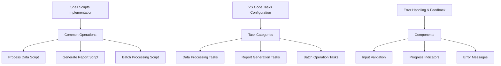

# Workflow Automation Plan

## Overview
This document outlines the implementation plan for automating common workflows in the Performance Review Tracking System through shell scripts and VS Code task configurations.

## Shell Scripts Implementation


### 1. Shell Scripts (`scripts` directory)

#### 1.1 Process Data Script (`process-data.sh`)
- **Purpose**: Process single or multiple data files
- **Features**:
  - Input validation
  - Date range handling
  - Output path configuration
- **Usage**:
  ```bash
  ./scripts/process-data.sh --input <file> --type <annual|competency> [--year YYYY]
  ```

#### 1.2 Generate Report Script (`generate-report.sh`)
- **Purpose**: Generate reports from processed data
- **Features**:
  - Multiple format support (MD/DOCX)
  - Template selection
  - Output naming conventions
- **Usage**:
  ```bash
  ./scripts/generate-report.sh --input <file> --format <markdown|docx> --output <path>
  ```

#### 1.3 Batch Process Script (`batch-process.sh`)
- **Purpose**: Process multiple entries in batch
- **Features**:
  - Directory monitoring
  - Parallel processing
  - Progress tracking
- **Usage**:
  ```bash
  ./scripts/batch-process.sh --input-dir <directory> --output-dir <directory>
  ```

## VS Code Tasks Configuration

### 1. Task Definitions (`.vscode/tasks.json`)

#### 1.1 Data Processing Tasks
```json
{
  "version": "2.0.0",
  "tasks": [
    {
      "label": "Process Data",
      "type": "shell",
      "command": "./scripts/process-data.sh",
      "args": [
        "--input",
        "${input:dataFile}",
        "--type",
        "${input:reviewType}",
        "--year",
        "${input:reviewYear}"
      ],
      "problemMatcher": []
    }
  ]
}
```

#### 1.2 Report Generation Tasks
```json
{
  "label": "Generate Report",
  "type": "shell",
  "command": "./scripts/generate-report.sh",
  "args": [
    "--input",
    "${input:processedData}",
    "--format",
    "${input:outputFormat}",
    "--output",
    "${input:outputPath}"
  ],
  "problemMatcher": []
}
```

#### 1.3 Batch Processing Tasks
```json
{
  "label": "Batch Process",
  "type": "shell",
  "command": "./scripts/batch-process.sh",
  "args": [
    "--input-dir",
    "${input:inputDirectory}",
    "--output-dir",
    "${input:outputDirectory}"
  ],
  "problemMatcher": []
}
```

## Error Handling & User Feedback

### 1. Input Validation
- Implement file existence checks
- Validate input formats
- Verify parameter values
- Show clear error messages for invalid inputs

### 2. Progress Indicators
- Display progress bars for long-running operations
- Show step completion indicators
- Provide time estimates for batch operations
- Include operation status updates

### 3. Error Messages
- Provide clear error descriptions
- Include suggested solutions
- Maintain detailed logs for debugging
- Implement error recovery mechanisms

## Implementation Steps

1. Create `scripts` directory
2. Implement shell scripts with error handling
3. Create `.vscode` directory
4. Configure VS Code tasks
5. Test individual components
6. Test integrated workflow
7. Document usage instructions

## Next Actions

1. Switch to Code mode for implementation
2. Create required directories
3. Implement shell scripts
4. Configure VS Code tasks
5. Test the automation workflow